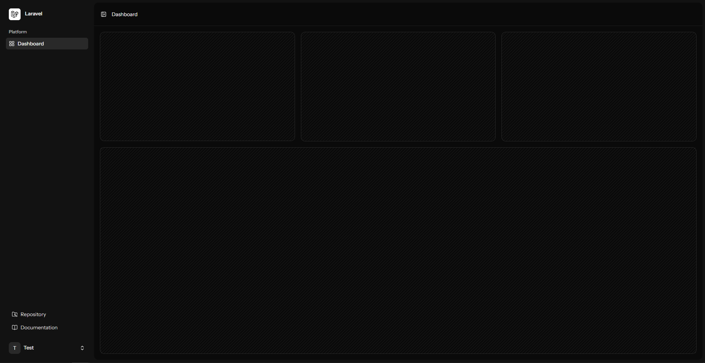

# Content Production Tracker

A Laravel-based content production tracker created as part of the Software Development Internship Day 1 assignment.

The project demonstrates Laravel authentication, MySQL database configuration, Inertia.js, Vue, and TypeScript working together in a small full-stack application.

## Technology Stack

* **Backend:** Laravel
* **Frontend:** Vue 3
* **Language:** PHP, TypeScript
* **Frontend integration:** Inertia.js
* **Database:** MySQL
* **Authentication:** Laravel built-in authentication
* **Testing:** Pest
* **Build tooling:** Vite
* **Package managers:** Composer, npm

## Local Installation

### Requirements

Make sure the following are installed:

* PHP 8.4 or compatible PHP version
* Composer
* Node.js and npm
* MySQL
* Git

MySQL can be provided through XAMPP, a standalone MySQL installation, Docker, or another compatible local setup.

### 1. Clone the repository

```bash
git clone <repository-url>
cd content-production-tracker
```

### 2. Install PHP dependencies

```bash
composer install
```

### 3. Install frontend dependencies

```bash
npm install
```

### 4. Create the environment file

Copy the example environment file:

```bash
cp .env.example .env
```

On Windows PowerShell:

```powershell
Copy-Item .env.example .env
```

Generate the Laravel application key:

```bash
php artisan key:generate
```

## Database Setup

Create a MySQL database named:

```text
content_production_tracker
```

Then configure the database section of `.env`:

```env
DB_CONNECTION=mysql
DB_HOST=127.0.0.1
DB_PORT=3306
DB_DATABASE=content_production_tracker
DB_USERNAME=root
DB_PASSWORD=
```

Update the username and password if your local MySQL installation uses different credentials.

Run the migrations:

```bash
php artisan migrate
```

## Running the Application

Start the Laravel development server:

```bash
php artisan serve
```

In a separate terminal, start the frontend development server:

```bash
npm run dev
```

Open the URL displayed by Laravel in your browser.

Register a new account, log in, and open the dashboard.

## Running the Tests

Run the Laravel test suite:

```bash
php artisan test
```

The Day 1 implementation includes tests verifying:

* Guests cannot access the dashboard.
* Authenticated users can access the dashboard.
* Authenticated users receive the Internship Progress data.

Some starter-kit two-factor authentication tests may be skipped because two-factor authentication is not enabled.

## TypeScript Check

Run the Vue TypeScript checker:

```bash
npm run type-check
```

This runs:

```bash
vue-tsc --noEmit
```

and checks the Vue/TypeScript code without generating output files.

## Day 1 Progress

### Completed

* Created the Laravel project.
* Configured MySQL.
* Ran database migrations successfully.
* Verified the authentication flow.
* Added the Internship Progress section to the dashboard.
* Added typed Vue component props using TypeScript.
* Connected the authenticated user's name to the Internship Progress component.
* Added automated dashboard tests.
* Added TypeScript checking.
* Added Day 1 documentation and screenshots.

### Current Day 1 Status

**Environment ready**

Project: **Content Production Tracker**

Current day: **Day 1**

## Screenshots

Screenshots demonstrating the authentication flow and dashboard are available in:

docs/


### Registration


### Dashboard


