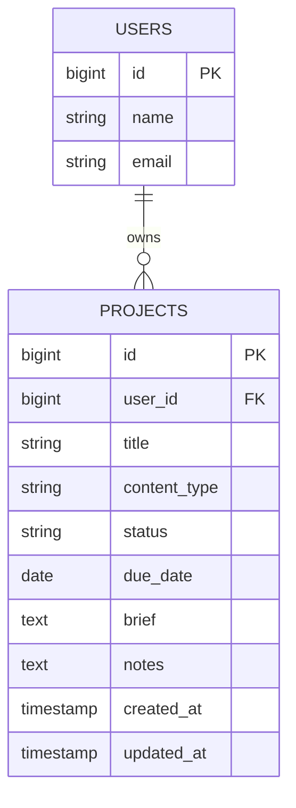
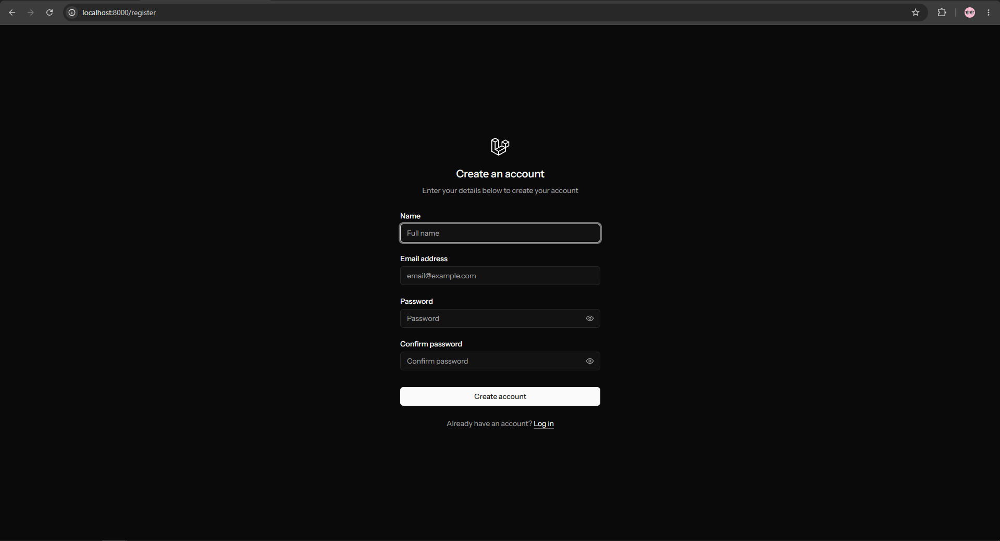
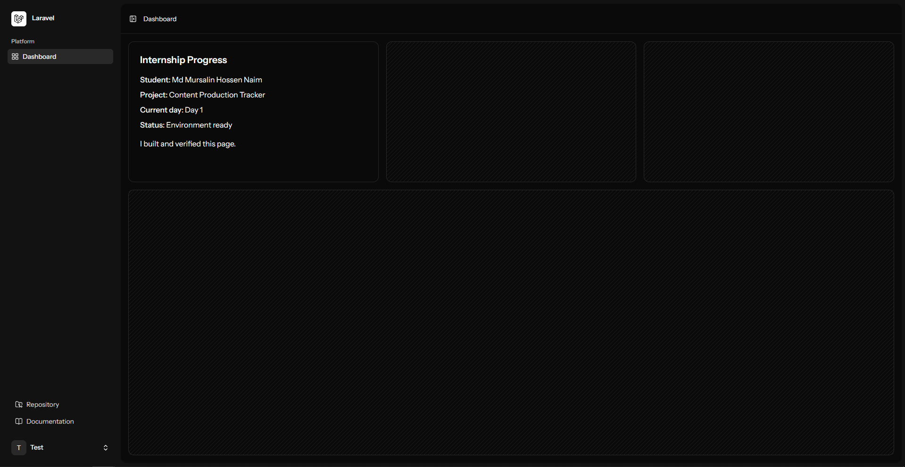
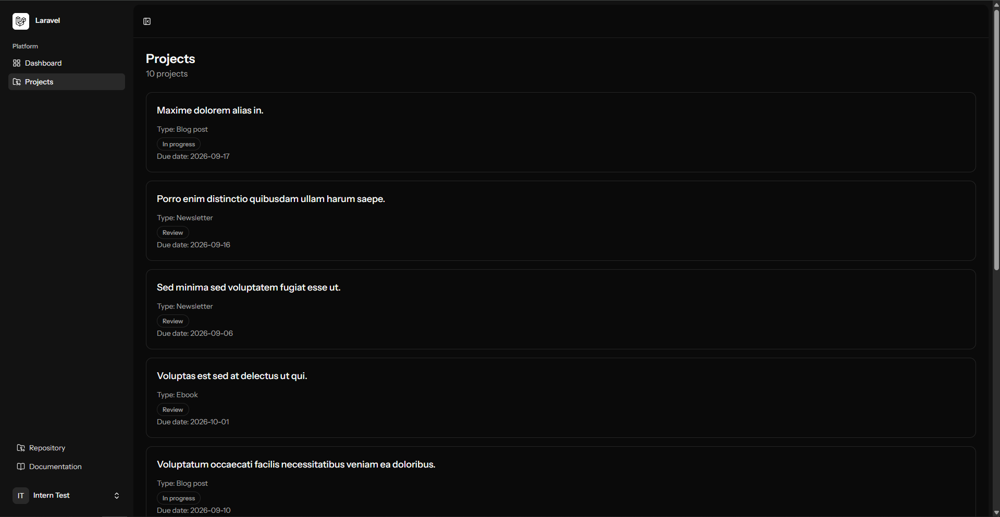

# Content Production Tracker

A Laravel-based content production tracker created as part of a Software Development Internship assignment.

The project is being developed incrementally across multiple internship days, with each day building on the previous work.

## Technology Stack

- **Backend:** Laravel
- **Frontend:** Vue 3
- **Language:** PHP, TypeScript
- **Frontend integration:** Inertia.js
- **Database:** MySQL
- **Authentication:** Laravel starter kit authentication
- **Testing:** Pest
- **Build tooling:** Vite
- **Package managers:** Composer, npm
- **Development environment:** Laravel Herd, XAMPP MySQL

## Local Installation

### Requirements

Make sure the following are installed:

- PHP 8.4 or compatible PHP version
- Composer
- Node.js and npm
- MySQL
- Git

### 1. Clone the repository

```bash
git clone <repository-url>
cd content-production-tracker
```

### 2. Install PHP dependencies

```bash
composer install
```

### 3. Install frontend dependencies

```bash
npm ci
```

### 4. Create the environment file

Copy the example environment file:

```bash
cp .env.example .env
```

On Windows PowerShell:

```powershell
Copy-Item .env.example .env
```

Generate the Laravel application key:

```bash
php artisan key:generate
```

## Database Setup

Create a MySQL database for the application and configure the database section of `.env`:

```env
DB_CONNECTION=mysql
DB_HOST=127.0.0.1
DB_PORT=3306
DB_DATABASE=content_production_tracker
DB_USERNAME=root
DB_PASSWORD=
```

Update the username and password if your local MySQL installation uses different credentials.

Run the migrations:

```bash
php artisan migrate
```

To create a fresh development database with the sample project data:

```bash
php artisan migrate:fresh --seed
```

## Development-only Demo Account

A demo account is included for local development and testing:

- **Name:** Intern Test
- **Email:** [intern@example.test](mailto:intern@example.test)
- **Password:** password

These credentials are intended for development only and must not be used for a production environment.

## Running the Application

Start the Laravel development environment:

```bash
composer run dev
```

The application can also be started with the Laravel and frontend development servers separately:

```bash
php artisan serve
```

In a separate terminal:

```bash
npm run dev
```

Open the URL provided by Laravel in your browser.

The application includes:

- Registration
- Login
- Authenticated dashboard
- Internship Progress section
- Project listing

## Projects

The Projects feature was added during Day 2 of the internship assignment.

Authenticated users can access:

```text
/projects
```

The Projects page displays projects belonging to the currently authenticated user.

Each project contains:

- Title
- Content type
- Status
- Due date
- Owner
- Brief
- Notes
- Creation and update timestamps

Supported content types:

- Ebook
- Blog post
- Newsletter
- Social post

Supported statuses:

- Draft
- In progress
- Review
- Complete

Projects belong to one user, while a user can have multiple projects. Users can only view their own projects.

Projects are displayed with the newest projects first. If a user has no projects, the page displays a clear empty state.

The complete project data requirements are documented in:

```text
docs/PROJECTS-SPEC.md
```

## Project Data Model

The relationship between users and projects is a one-to-many relationship:



Each project belongs to exactly one user through the `user_id` foreign key. A user can own multiple projects, allowing the application to retrieve and display only the projects belonging to the authenticated user.

## Running the Tests

For a clean checkout, install the dependencies, build the frontend assets, and then run the test suite:

```bash
composer install
npm ci
npm run build
php artisan test
```

If the project dependencies and frontend assets are already built, you can run the test suite directly:

```bash
php artisan test
```

The test suite covers:

- Guests are redirected to the login page.
- Authenticated users can access the dashboard.
- Authenticated users can see the Internship Progress section.
- Guests cannot access the Projects page.
- Authenticated users can access the Projects page.
- Users can see their own projects.
- Users cannot see projects belonging to another user.
- Projects are displayed newest first.
- Users with no projects receive an empty project list.
- Project model relationships work correctly.
- Projects are deleted when their owning user is deleted.

The final Day 2 test result was:

```text
Tests: 3 skipped, 33 passed (114 assertions)
```

The skipped tests are starter-kit two-factor authentication tests that are not applicable because two-factor authentication is not enabled.

## TypeScript Check

Run the Vue TypeScript checker:

```bash
npm run type-check
```

This runs:

```bash
vue-tsc --noEmit
```

The TypeScript check passed successfully with no errors at the end of Day 2.

## Day 1 Progress

### Completed

- Created the Laravel project.
- Configured the local MySQL database.
- Ran the initial database migrations.
- Verified the authentication flow.
- Added the Internship Progress section to the dashboard.
- Added typed Vue component props using TypeScript.
- Connected the authenticated user's name to the Internship Progress component.
- Added automated dashboard tests.
- Added TypeScript checking.
- Added Day 1 documentation and screenshots.

### Day 1 Testing

The Day 1 test suite completed with:

- **24 tests passed**
- **3 tests skipped**
- **0 tests failed**
- **65 assertions**

The TypeScript check also passed successfully.

## Day 2 Progress

### Completed

- Defined the Project data requirements in `docs/PROJECTS-SPEC.md`.
- Added the User–Project database relationship.
- Created the Project model and migration.
- Added the required Project fields and database constraints.
- Added the `projects()` relationship to the User model.
- Added the `user()` relationship to the Project model.
- Added a Project factory with realistic development data.
- Added a database seeder with one demo user and ten sample projects.
- Added the authenticated `/projects` route.
- Created the Project controller.
- Created the Projects Vue page using TypeScript.
- Added the Projects navigation item to the sidebar.
- Displayed the project title, content type, status, due date, and total project count.
- Added a clear empty state for users without projects.
- Ensured projects are retrieved through the authenticated user's relationship.
- Added feature tests for authentication, ownership, ordering, and empty-state behavior.
- Verified the complete Laravel test suite.
- Verified the Vue TypeScript check.

### Day 2 Testing

The final Day 2 verification completed with:

- **33 tests passed**
- **3 tests skipped**
- **0 tests failed**
- **114 assertions**
- **TypeScript check passed**

## Screenshots

Screenshots demonstrating the authentication flow and dashboard are available in:

```text
docs/
```

### Registration



### Dashboard



### Projects


