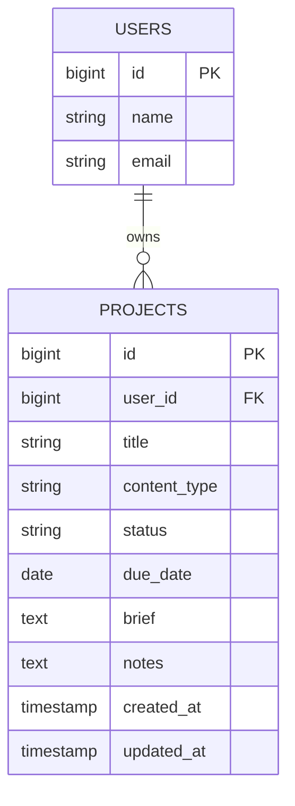

# Project Specification

## Overview

The first version of a content project represents a piece of content that a user is planning, creating, or managing.

Each project belongs to exactly one user and contains the information needed to identify the content, track its progress, and record instructions or notes.

## Project Fields

| Field          | Requirement                                              |
| -------------- | -------------------------------------------------------- |
| `id`           | Primary key                                              |
| `user_id`      | Owner of the project                                     |
| `title`        | Required, maximum 150 characters                         |
| `content_type` | Required string, maximum 50 characters                   |
| `status`       | Required string, maximum 30 characters                   |
| `due_date`     | Optional date                                            |
| `brief`        | Optional text containing the user's content instructions |
| `notes`        | Optional text                                            |
| `created_at`   | Creation time                                            |
| `updated_at`   | Last update time                                         |

## Allowed Content Types

The first version supports the following content types:

* Ebook
* Blog post
* Newsletter
* Social post

## Allowed Statuses

The first version supports the following project statuses:

* Draft
* In progress
* Review
* Complete

## Ownership and Access Rules

1. A project belongs to one user.
2. A user can have many projects.
3. A user can view only their own projects.
4. A guest cannot open the Projects page.

## Project Listing Behavior

Projects should be displayed with the newest projects appearing first, based on their creation time.

If a user has no projects, the Projects page should display a clear empty state explaining that there are currently no projects and providing an appropriate next step for creating one.

## Scope

This specification describes the data and expected behavior for the first version of content projects. It does not define implementation details.
## Database Relationship

A user can own multiple projects, while each project belongs to exactly one user. The user_id field belongs in the projects table because it identifies which user owns each individual project and allows the application to restrict users to viewing only their own projects. This creates a one-to-many relationship between users and projects.
